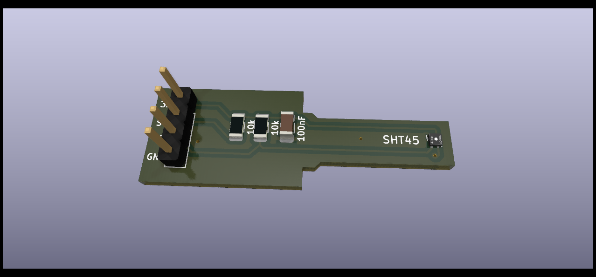
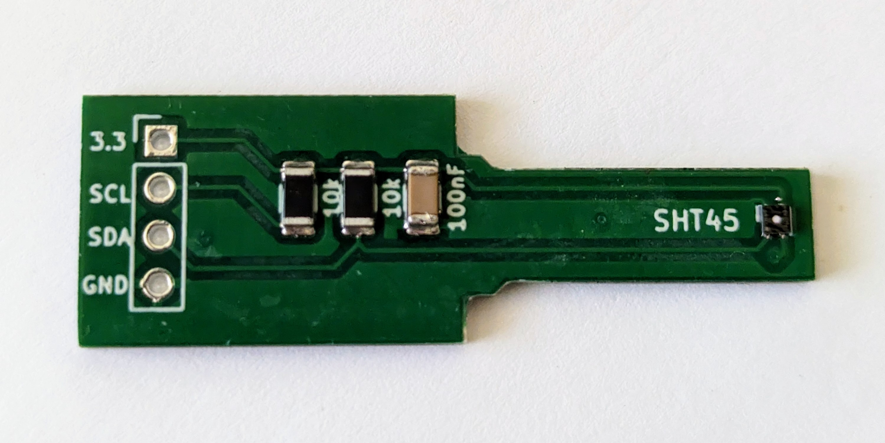
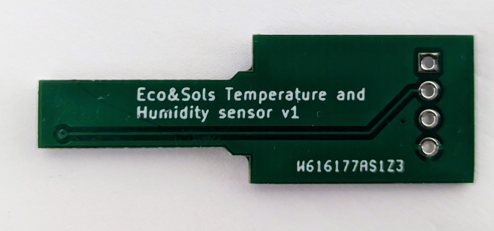

# Accurate air temperature and humidity measurement
The aim of this project is to build an accurate air temperature and humidity sensor for environmental science. We will be using the SHT45 sensor from sensirion since it presents the right accuracy, precicison and drift for the job. Due to its use outdoors we will use the version equipped with a PTFE filter membrane. 

## The PCB board

## Bill of materials
- 2 10kOhm 1206 resistors (0.109€ - bought [here](https://fr.rs-online.com/web/p/resistances-a-montage-en-surface/6791765))
- 1 100nF 1206 capacitor (0.05€ - bought [here](https://fr.rs-online.com/web/p/condensateurs-ceramique-multicouches/1335654))
- 1 SHT45-AD1F-R2 sensirion sensor (3.07 € - bought [here](https://www.mouser.fr/ProductDetail/403-SHT45-AD1F-R2))
- 50 PCBs and 1 stencil (70€ - PCBway)

### Cost per sensor
The cost of the sensor board is 5€. Time to apply solder paste and reflow is around 20min. So considering somebody paid 60€ an hour this amounts to 25€ per sensor. 

## Microclimate radiaion shield
To complement the sensor we have designed a small and discrete radiation shield that is optimised for 3D printing. This is to be used inside canopies to measure the local microclimate. It is designed in 3 parts and the bottom part has a well-adjuster holder for the PCB.
This piece should ideally be printed with UV resistant white PETG. We use the Nanovia PETG-GF-UV: [https://nanovia.tech/en/ref/nanovia-petg-gf-uv/](https://nanovia.tech/en/ref/nanovia-petg-gf-uv/)

### Cost per shield
The material costs per shield are estimated at around 3€ if we consider that a 500g spool of this filament costs around 40€. 

## Final result
### Front of the reflowed board

### Back of the reflowed board

